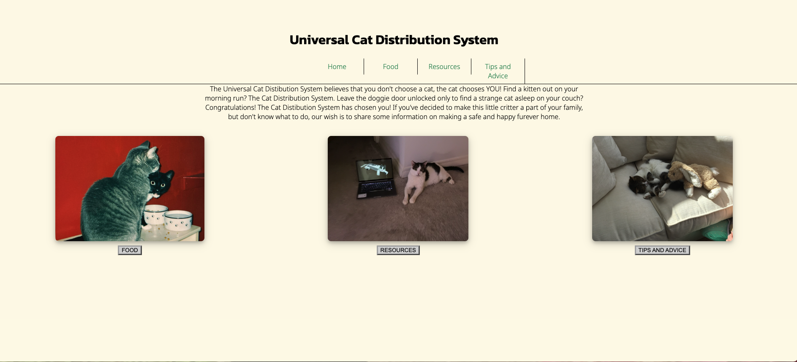
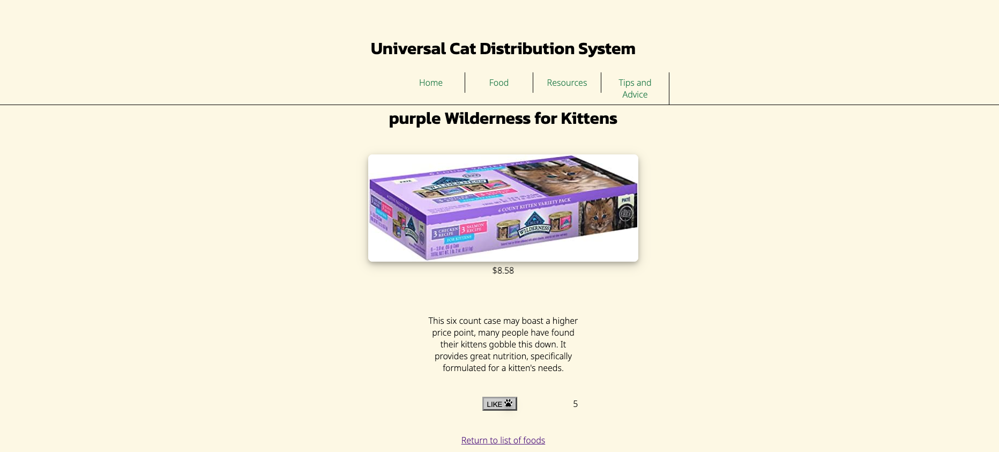
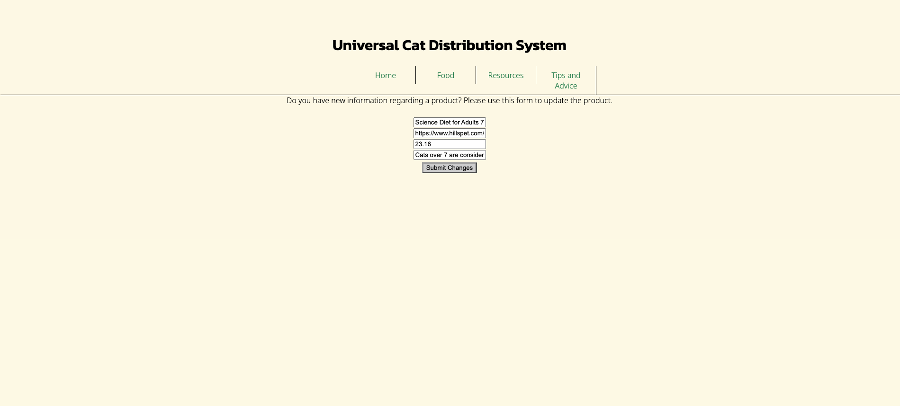
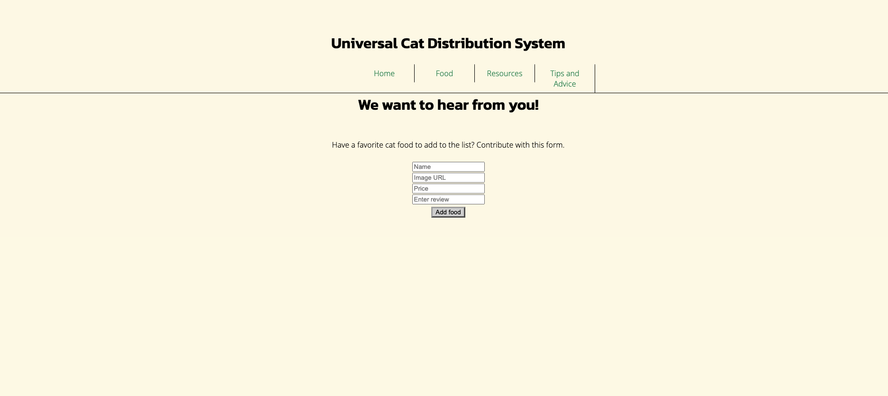
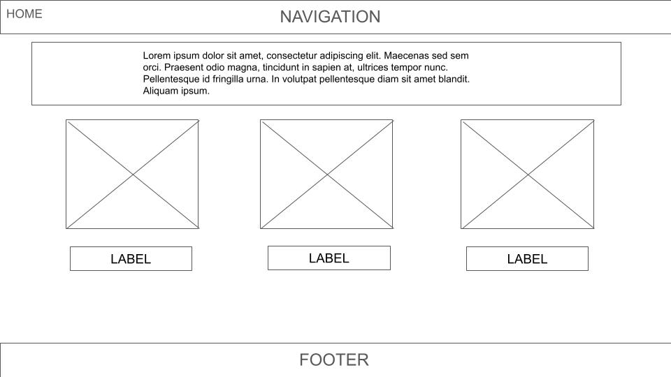
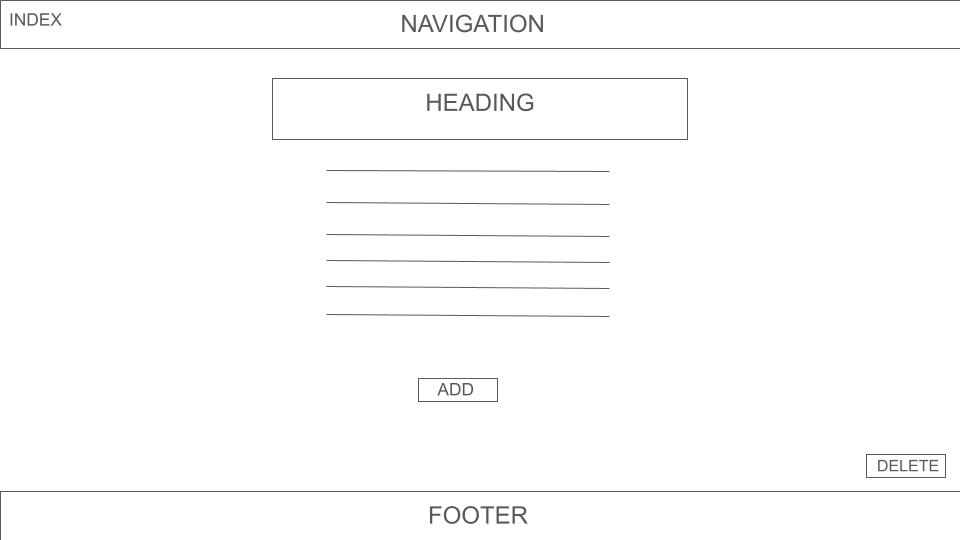
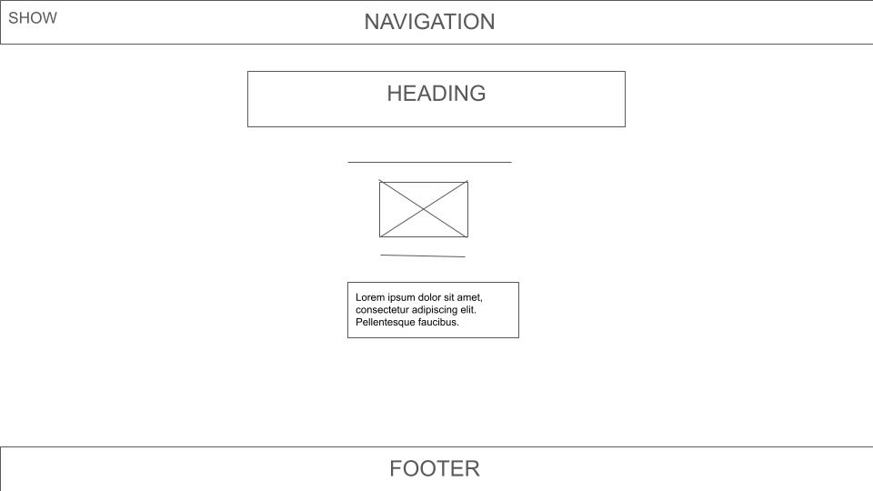
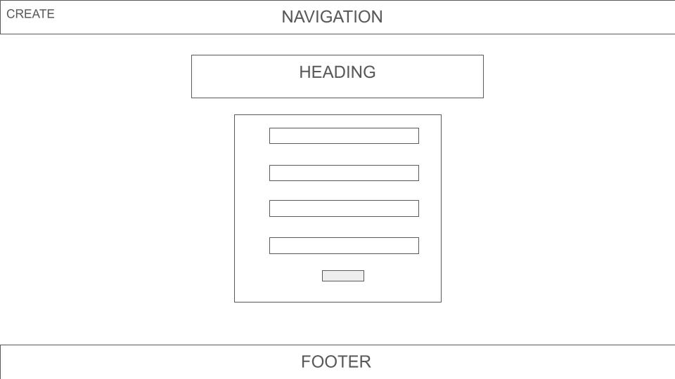

# Cat-D-S
The Cat Distribution Systme App
A full crud app designed to provide community and advice to new cat owners

The purpose is to provide advice and support to new cat owners. The app will link to lists of recommended cat foods for kittens, cats, and seniors; recommended online resources/blogs for advice on cat ownership; general advice page

## Table of Contents
* [Technologies Used](#technologiesused)
* [Features](#features)
* [Design](#design)
* [Project Next Steps](#nextsteps)
* [Deployed App](#deployment)
* [About the Author](#author)

## Technologies Used
* EJS
* JavaScript
* HTML5
* CSS3

## Features
* The user should be able to select the option of list of food for cats
* The user should be able to view the details of a particular brand
* The user should be able to add a food to the list
* The user should be able to "like" a brand
* The user should be able to edit information on a brand
* The user should be able to delete a food

## Design
* Wireframe Images

## Next Steps
* I would like to do more styling
* I would like to implement Google Maps to highlight nearby vets and shelters

## Deployment

## About the Author
I am a Software Engineer specializing in FullStack Development. In my previous career, I have held roles in corporate and education, which allows me to be a supportive and productive teammate. I excel at collaboration and understand the importance and impact a role has to a business. I aspire to bring my strengths in technology and appreciation of aesthetics and mood to a company’s online presence. I am looking to be a part of a team that fills a customer's needs related to a subject close to their hearts.
